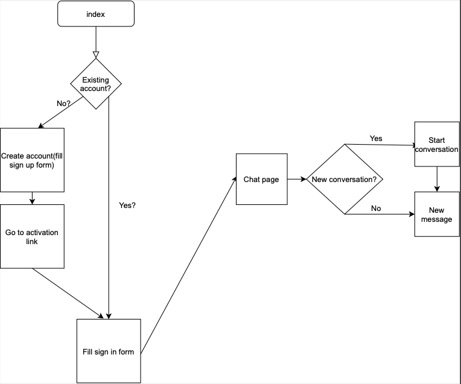
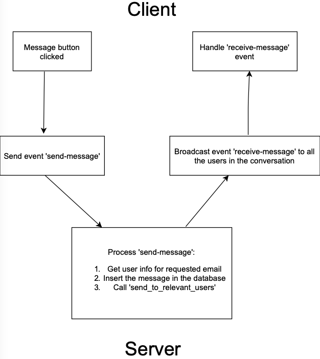

[](https://github.com/AlexandruIca/MDS/actions/workflows/StaticAnalysis.yml)
[](https://github.com/AlexandruIca/MDS/actions/workflows/Testing.yml)
---
# Real Time Messaging

## Membrii
* [Gherghina Roxana-Ioana](https://github.com/roxana1708) (231)
* [Ica Alexandru-Gabriel](https://github.com/AlexandruIca) (232)
* [Arsene Marinel](https://github.com/Arsene-Marinel) (233)
* [Cioarec George](https://github.com/George2208) (233)
* [Tudose Mihai-Cristian](https://github.com/jungle335) (233)


## Ce face aplicatia?
Inspirata de modelul de WhatsApp si Discord, in aplicatia noastra clientul poate sa isi creeze cont, sa trimita mesaje in timp real si sa caute useri cu care sa inceapa conversatii. 

## User Stories

1. Utilizatorul isi poate face un cont nou: va introduce datele necesare (email, parola) si va primi un mail de confirmare.
2. Utilizatorul se poate loga/deloga.
3. Odata logat, poate cauta membri print-un meniu de search.
4. Poate vedea conversatiile din care face parte.
5. Poate trimite mesaje text care vor fi vazute in timp real de catre ceilalti participantii.
6. Poate trimite fisiere in timp real, care pot fi descarcate de catre destinatar. (partial)
7. Sa salveze un mesaj in sectiunea de “importante”. (partial)
8. Sa poata sterge un mesaj de-al lui. (partial)
9. Sa poata da reply la un mesaj. *
10. Sa poata cauta mesaje in conversatie. *
11. Recuperare cont in caz ca utilizatorul uita parola. *

\* aceste cerinte nu au fost implementate


## Backlog

Backlogul se afla [aici](https://github.com/AlexandruIca/MDS/projects/1) 


## UML

Cum functioneaza conceptual?


Cum comunica clientul cu serverul?



## Source Control

Initial am avut doua branch-uri, deoarece eram indecisi in privinta framework-ului pe care sa il utilizam.
Tot proiectul se află pe github; commit-urile se pot vedea aici.


## Teste Automate

La fiecare push se executa doua script-uri pentru continuous integration:
* [`Testing.yml`](https://github.com/AlexandruIca/MDS/blob/main/.github/workflows/Testing.yml) -> cateva teste pentru a ne asigura de functionarea login-ului
* [`StaticAnalasys.yml`](https://github.com/AlexandruIca/MDS/blob/main/.github/workflows/StaticAnalysis.yml) -> verifica cu flake8 formatarea fisierelor python


## Bug Reporting

Issues: [#21](https://github.com/AlexandruIca/MDS/issues/21) si [#22](https://github.com/AlexandruIca/MDS/issues/22).

## Python Environment Tools
Poetry
* pentru managmentul bibliotecilor externe si versiunilor de python
* in fisierul [poetry.lock](https://github.com/AlexandruIca/MDS/blob/main/backend/poetry.lock) se afla versiunile dependintelor (pentru ca fiecare dintre noi sa aiba aceleasi versiuni)

## Code Standards
Codul respecta style guide-ul [PEP8](https://www.python.org/dev/peps/pep-0008/).

## Design Patterns
* Client/Server - clientul deschide si comunica mesaje de tip JSON cu serverul printr-un WebSocket
* Object Pool - tinem un 'pool' de conexiuni WebSocket pentru a vedea care users sunt conectati, pentru a putea trimite mesajele in real time

## Run your own server

Asigura-te ca ai [poetry](https://python-poetry.org/) instalat, iar apoi in terminal:
```sh
cd backend/

poetry install

../scripts/run.sh
```
Odata ce serverul a pornit deschideti [client/index.html](client/index.html) in browser si conectati-va.

